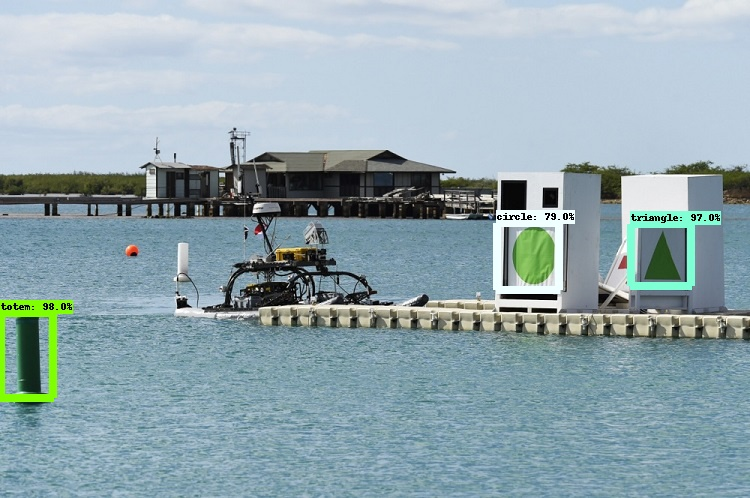
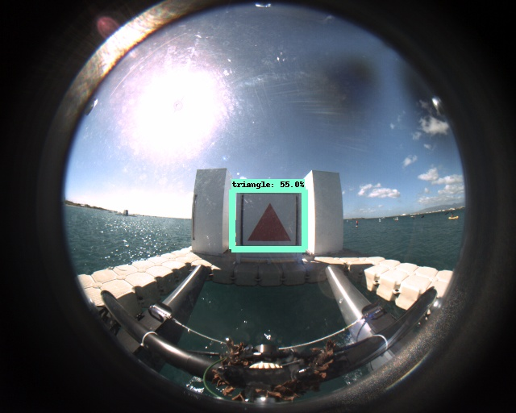
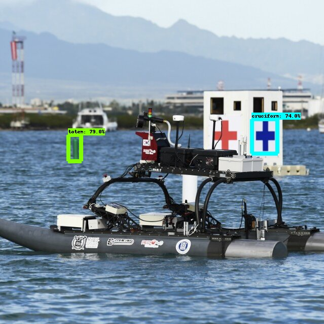

# How to use the pipeline?

## Important note:

The instructions below will be assuming that the task of future members is to:

0. Download the pipeline that was set up.
1. Collect more quality training and testing images.
2. Labelled the newly collect images.
3. Retrain the network.

Head over to `create_pipeline.md` for more info on how the whole thing is being set up.

## 0. Download the pipeline.

Please download the folders over at my [Google Drive](https://drive.google.com/drive/folders/1669iQFZg1kmxT-e_k6j4973mFD11Sb7v?usp=sharing).


## 1. Collect data

The current data collected,labelled and trained on can be found at `models/research/object_detection/images/train`.

To date (2020), the RobotX team has not collected any quality images at prior competitions and images of competition online is very limited (a quick google search will confirm this). Please attempt to collect more images with the boat on the water. It will be especially useful to gather lots of images from the competition itself if the organiser permits time for trial runs (I heard that there will be a free day). You can then take all of these images, labelled them and retrain. Algorithm will work super well if the data collected is similar/exactly like the competition scene.

Add the training images that you have collected to the folder `object_detection/images/train`, testing images into `object_detection/images/test`.

**In my case, since the amount of data was very limited, I generated fake data to compensate but it is still always the rule of thumb to collect data in real-world scenarios. Head over to [here](https://github.com/timothylimyl/robotx_od_pipeline/tree/master/robotx_generation) if you are interested checking out what was generated and how it was generated**

## 2. Label the images

The labelImg folder contains the labelling application. Please read how does the annotation tool work over at the [official repo](https://github.com/tzutalin/labelImg), it is very simple.

The application will produce `*.xml` files for each of your labelled images. Before labelling, please rename the collect images according to 
last/highest number in the folder (current:700) so you will need to rename your images from 701.jpg onwards (use `images/renaming.py` and edit accordingly to your path of new images). 

**Note that the current labels are `totem`,`cruciform`,`circle`,`triangle` which are the current 4 object of interests. If there are more objects of interest needed to be added, there are quite a few changes that needs to be made:**

a. Go to `object_detection/generate_tfrecord.py` and add more labels for new objects to `line 32` (name of label must be same as what u type into labelImg).
b. Go to `object_detection/training/pbtxt_generation.py` and add more labels for new objects. Run it to generate new `label_map.pbtxt`.
c. Go to `object_detection/training/_____.config` and change the number of classes.

Note that if you changed the `label_map.pbtxt` and `____.config` file, you will need to overwrite the current one over at the folder `object_detection/training` and also the folder that uses it for inference `use_for_inference/training`

Once you are done labelling, move all images and its labels(`*.xml`) into images/train to merge with the old labelled images. Next, convert all of the `*.xml` files to an excel spreadsheet. This can be done by running `xml_to_csv` (object_detection/images) which creates `train_labels.csv` and `test_labels.csv`. `*.xml` files has to be converted into TFRecords for Tensorflow to train the network. Go to `line 32 generate_tfrecord.py` and add the objects label.

In terminal (Ensure u are in path: models/research/object_detection): 

To create train data record for tensorflow:

```
python generate_tfrecord.py --csv_input=images/train_labels.csv --image_dir=images/train --output_path=train.record
```

To create test data record for tensorflow:

```
python generate_tfrecord.py --csv_input=images/test_labels.csv  --image_dir=images/test --output_path=test.record

```

## 3. Retrain

I have set up an easy to use *.ipynb script that is suppose to work "out of the box". The reason why I set it up to be a *.ipynb script is so that you can use Colaboratory to train (free of charge cloud GPU offered by Google), roughly 12 hours of free runtime on a Tesla K80.

Save the whole folder into your google drive. Run `training_custom_object_detection.ipynb` to train. The notebook will export the newly train frozen graph containing the entire neural network model with all of its parameters once training is done. To run the inference, all you will need is the frozen trained model and the label_map.pbtxt. 

*Please read through the notebook script before running to get an understanding of what u are running first*


## 4. Run inference

Run `inference.ipynb` to learn how to run the inference and check the inference speed. Go to `use_for_inference` folder, you can see example of results that I have write into folder `saved_images`. I strongly believe that if real data is collected, the network can easily detect the necessary objects in Robotx without error as the objects are relatively simple.

This will be the "final" script to be run in before testing it with the embedded hardware with the camera.

## Sample result

Sample result:
Good            |  Average   | Poor
:-------------------------:|:-------------------------:|:-------------------------:
   |  | 


# Dependencies:

Tensorflow 1.x, Python 3.7

**Edit (As of 08/2020): TF2 is made available for the Object Detection API. TF2 provides with more selection of network models. If future members decides to shift to TF2, I recommend following this [TUTORIAL](https://tensorflow-object-detection-api-tutorial.readthedocs.io/en/latest/index.html), please do read through what I have set up too as it will give u a better idea on the overall picture and the set up is 90% similar over at `create_pipeline.md`.**
