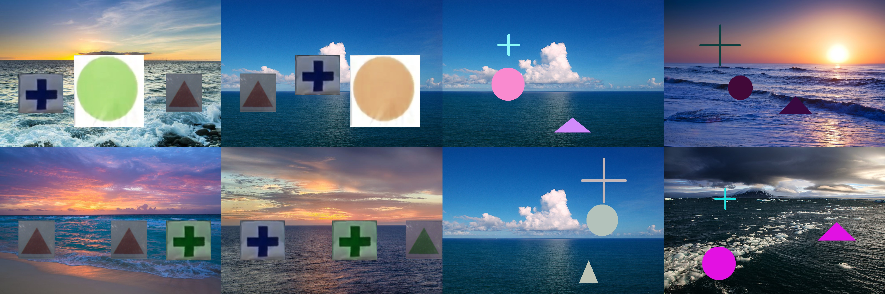

# Generation of RobotX Data (Images)

Go over to my google drive for the [full folder](https://drive.google.com/drive/folders/170pHSGsm8GWRfVX1TI-WNVOIN56qY-HT?usp=sharing).

## Setup:

#### a. Collecting background images

Get background images from google and stored in the folder `background`.

#### b. nerating shapes on random background

`data_generation_shapes.py` generates shapes of random size on the background images provided. The generated images are stored in the folder `generated`.

#### c. Generating RobotX Shapes on random background

`data_generation_robotx_shapes.py` generates shapes with white background such as those commonly given in the RobotX competition task. I crop out the shapes from competition images and stored them in the folder `robotx_shape`. In `robotx_shape`, I cropped out 4 shapes from RobotX Competition images. I use the script `robotx_shape/generate_different_color.py` to provide me with the more of the same shape with different color. These shapes are all used in  `data_generation_robotx_shapes.py`

#### d. Visualise generated images

The script `visualisation.py` was used to produce a compilation of generated images:

## Final note

All of the generated images are transfer to the `train` folder in the 2D Object Detection Pipeline and labelled.
