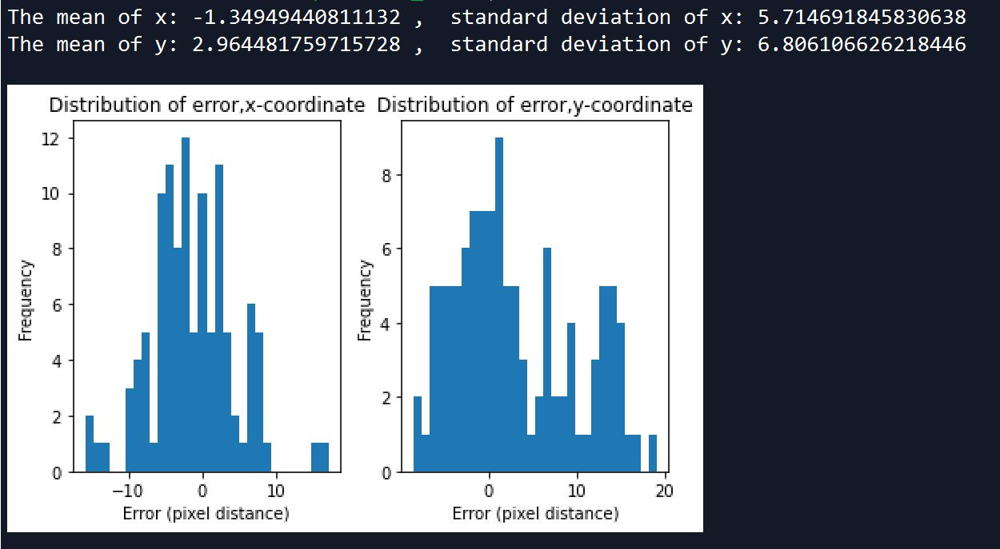

All the folders and files necessary are over at the same [google drive](https://drive.google.com/drive/folders/170pHSGsm8GWRfVX1TI-WNVOIN56qY-HT) location as data generation.

# Characterising Uncertainty:

#### a. Generating images that are unseen by the training process.

The folder of images can be found in `2DOD_Pipeline/use_for_inference/test_set_uncertainty` which consist of 40 images, each image contains 3 objects of interest. For more information of how images are generated, go to the `robotx_od_pipeline/robotx_generation` [folder](https://github.com/timothylimyl/robotx_od_pipeline/tree/master/robotx_generation) in this repo.

#### b. Get data on ground truth 

We will need to compare the Ground Truth coordinates of the midpoint of the bounding box versus the coordinates of the predicted. Ground truth coordinates is compiled by labelling using `labelImg` (explained in the readme.md of pipeline) and the coordinates information is stored in the folder `test_uncertainty_gt` as `.xml` files. All the ground truth information in `.xml` files are converted to a single `.csv` file using `xml_to_csv.py`.   

#### c. Get data on predictions (Inference on trained model)

The model predictions was taken from the [2DOD Pipeline](https://github.com/timothylimyl/robotx_od_pipeline). In the google drive of the pipeline, there is a folder `use_for_inference` which consist of image folders for inference. By running inference through all images from `2DOD_Pipeline/use_for_inference/test_set_uncertainty` by running the script `2DOD_Pipeline/inference_uncertainty.ipynb`, we compiled the bounding box predictions into a `.csv` file `2DOD_Pipeline/use_for_inference/coordinate_predictions.csv`.

**Please read through the inference script `inference_uncertainty.ipynb`, there are written comments there that will help you understand what is the script doing.**

#### d. Computation of error

Now that we have the ground truth and predictions of bounding box position, a script was written to parse the data (`robotx_uncertainty/uncertainty_characterisation.py`).  We move the `.csv` files of the ground truth and prediction into the folder `robotx_uncertainty`.

By running `robotx_uncertainty/uncertainty_characterisation.py`, the script will do a few things for us:

   1. It will properly set up the ground truth bounding box positions to match the bounding box predicted. The ground truth `.csv` has a few issues that we need to deal with first. We need to sort the images in ascending order according to the filename, then we will need to sort it in ascending order according to the minimum x-coordinate value (`xmin`) within the same image to ensure that bounding box coordinates are in the order from left of the image to the right.
   
   2. It finds the midpoint each bounding box.
   
   3. It compares the midpoint of the ground truth label to that of the model prediction.
   
   4. It computes the mean and standard deviation of the error in x and y-axis of the image, and plots a histogram of the error distribution as seen in the Figure below.
   
 
 
 
